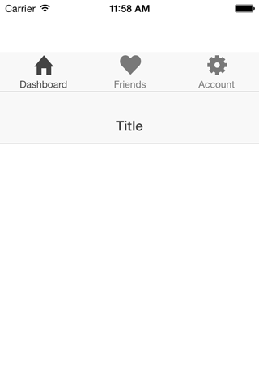

Ionic Bug
=====================

Showing a bug in ionic tabs when the tabs are placed on top. It is reproducable by placing an ion-header-bar in the same file as the tabs template file with the tabs-top class on the ion-tabs element.

Install with

```bash
$ ionic platform add ios
$ ionic build ios
$ ionic emulate ios
```

